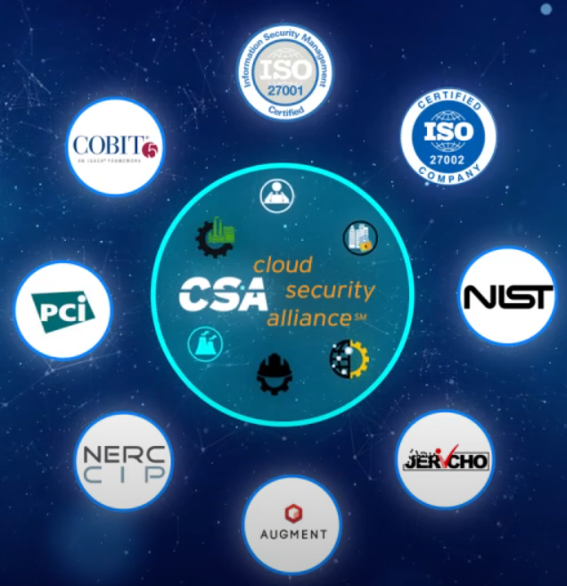

# 1\. Wat is de Cloud Controls Matrix (CCM) als Standaard/Framework?
De Cloud Controls Matrix (CCM), die is ontwikkeld door de Cloud Security Alliance (CSA), is een uitgebreid en machtig framework dat zich richt op cyberbeveiliging in cloud computing. Dit raamwerk biedt een reeks controledoelstellingen die zijn georganiseerd in verschillende domeinen en zich concentreren op de belangrijkste elementen van cloudtechnologie. Het is een veelzijdig hulpmiddel dat bedrijven helpt bij het systematisch beoordelen van de implementatie van hun cloud.

Het hart van de Cloud Controls Matrix (CCM) bestaat uit 17 domeinen, waarvan elk een essentieel onderdeel is van cloudbeveiliging, zoals identiteitsbeheer, gegevensbeveiliging en incidentbeheer. Elke domein bevat richtlijnen en controledoelstellingen voor zowel cloud service providers (CSP's) als cloud service klanten (CSC's).

Een belangrijk onderdeel van de CCM is de integratie en afstemming met andere gevestigde industrienormen. Dit omvat ISO/IEC 27001/27002/27017/27018, CIS Controls V8 en meer, waardoor het een onmisbare tool is voor organisaties die aan meerdere compliance-eisen moeten voldoen.

# 2\. Bijdrage van CCM aan Governance van Cloud Processen, Componenten, Services, Business en Gebruikers
Door een duidelijk raamwerk te bieden voor het beheer van securityrisico's en het waarborgen van compliance, draagt de Cloud Controls Matrix (CCM) aanzienlijk bij aan de governance van cloud-gerelateerde processen en services. Het bevat uitgebreide richtlijnen en beste praktijken voor het uitvoeren van beveiligingsmaatregelen, die essentieel zijn voor het handhaven van de veiligheid en integriteit van cloudservices.

Procedures en onderdelen: De domeingerichte structuur van Cloud Controls Matrix (CCM) zorgt ervoor dat elk onderdeel van de cloudinfrastructuur en -operaties wordt gedekt. Als gevolg hiervan kunnen organisaties een consistente aanpak van cloudbeveiliging implementeren en kunnen ze hun operaties standaardiseren.

Services en Business: De CCM draagt bij aan een veiligere en betrouwbaardere cloudomgeving door de controledoelstellingen aan te passen aan de behoeften van bedrijven. Dit vergemakkelijkt bedrijven in het benutten van cloudtechnologieën ter ondersteuning van hun zakelijke doelen, terwijl ze voldoen aan beveiligings- en compliance-eisen.

Mensen: De CCM biedt ook richtlijnen voor het betrekken van verschillende stakeholders, van IT-personeel tot het management, in de processen van cloud governance. Dit zorgt voor een breder begrip en betere uitvoering van cloudbeveiligingsbeleid binnen de organisatie.
# 3\. Volledigheid van de CCM in Termen van Governance
Hoewel Cloud Controls Matrix (CCM) een breed scala aan cloudbeveiligingsproblemen behandelt, zijn er enkele zorgen over de volledigheid ervan:

Governance-aspecten worden gedekt: De Cloud Controls Matrix (CCM) is goed in het bieden van uitgebreide controledoelstellingen voor technische en operationele aspecten van cloudbeveiliging. Toch kan het minder duidelijk zijn als het gaat om bredere governancethema's zoals cloudbeveiligingscultuur, beleidsontwikkeling en strategische planning.

De dynamiek van cloudtechnologie: Gezien de snelle evolutie van cloudtechnologie kan het voor elk framework, inclusief de CCM, moeilijk zijn om bij te blijven met de meest recente ontwikkelingen.

Regionale en bedrijfsspecifieke vereisten: Hoewel de CCM een breed scala aan normen en regels omvat, kunnen bepaalde regionale of bedrijfsspecifieke 
# 4\. Sterke Punten en Minder Goede Aspecten van de Cloud Controls Matrix (CCM)
Sterke aspecten:

Uitgebreide dekking: De Cloud Controls Matrix (CCM) omvat een uitgebreide set beveiligingscontroles die alle essentiële elementen van cloud computing dekken, waardoor het een nuttig hulpmiddel is voor organisaties die hun cloudbeveiliging willen verbeteren.

Standaardisatie en Vergelijkbaarheid: De CCM maakt het eenvoudiger om verschillende standaarden te vergelijken en na te leven door het uit te lijnen met ISO/IEC 27001 en NIST en andere belangrijke normen en regelgevingskaders.

Flexibiliteit: De Cloud Controls Matrix (CCM) kan worden aangepast aan een verscheidenheid aan cloudmodellen en -diensten, waardoor het geschikt is voor een groot aantal organisaties.

Bevordering van transparantie: het verbetert het begrip en het beheer van cloudbeveiligingsrisico's door CSP's en klanten duidelijke verantwoordelijkheden te geven.

Minder sterke aspecten:

Complexiteit en Implementatie-Uitdagingen: Voor kleinere organisaties kan de complexiteit van de CCM een barrière vormen voor effectieve implementatie.

Regionale en Sector-specifieke Vereisten: De CCM dekt mogelijk niet alle specifieke regionale of sector-specifieke vereisten af, wat aanvullende inspanningen vereist voor volledige naleving.
# 5\. Toepassing van de CCM door Grote Public Cloud Providers
Grote public cloud providers zoals Amazon Web Services (AWS), Microsoft Azure en Google Cloud Platform zijn zich ervan bewust dat cloudbeveiliging en compliance essentieel zijn. Deze organisaties bieden uitgebreide documentatie en hulpmiddelen om aan te tonen hoe hun diensten overeenkomen met de beveiligingscontroles en best practices die door de CCM worden aanbevolen.

AWS: AWS heeft uitgebreide documentatie die beschrijft hoe hun diensten overeenkomen met de Cloud Controls Matrix (CCM)-controles. Dit maakt het voor klanten gemakkelijker om te begrijpen hoe AWS bijdraagt aan het voldoen aan de CCM-normen.

Microsoft Azure: Azure biedt soortgelijke begeleiding en een uitgebreide mapping tussen zijn diensten en de CCM-beveiligingscontroles. Hierdoor kunnen klanten gemakkelijker risicobeoordelingen en compliance audits uitvoeren.

Google Cloud: Google Cloud biedt ook uitgebreide details over hoe hun beveiligingspraktijken aansluiten bij de Cloud Controls Matrix (CCM). Ze geven klanten de middelen om hun compliance te beoordelen en leggen de nadruk op transparantie.
# 6\. Conformiteit van Grote Public Cloud Providers aan de CCM
Als onderdeel van hun algemene beveiligings- en compliance-inspanningen willen de grote public cloud providers voldoen aan de CCM-standaarden. Ze bieden vaak uitgebreide mappings en documentatie om aan te tonen hoe hun diensten en beveiligingscontroles in overeenstemming zijn met de CCM. Het is belangrijk om te benadrukken dat de volledige conformiteit met de Cloud Controls Matrix (CCM) afhangt van de manier waarop eindgebruikers deze cloud-diensten implementeren en beheren. Hoewel cloudproviders tools en mogelijkheden bieden, zijn klanten voornamelijk verantwoordelijk voor het correct inzetten en onderhouden van deze controles.
# 7\. conclusie
Samenvattend, hoewel de Cloud Controls Matrix (CCM) een uitgebreid en aanpasbaar raamwerk biedt voor cloudbeveiliging, is het voor een succesvolle implementatie ervan noodzakelijk dat zowel de cloud providers als de gebruikers actieve betrokkenheid en management hebben. De grote cloud providers steunen de principes van de Cloud Controls Matrix (CCM) en bieden hun klanten hulpmiddelen om hen te helpen bij het navigeren en toepassen van deze controles in hun cloudomgevingen.
# Bronnenbeheer
Ampcus Inc. (2020, 18 juli). *GDPR | Cloud Security Alliance | Cloud Controls Matrix | AMPCUS Cyber* [Video]. YouTube. <https://www.youtube.com/watch?v=dbHElAzMBtg>

Csftools. (2021, 4 december). *CSA Cloud Controls Matrix - CSF Tools*. CSF Tools - The Cybersecurity Framework for Humans. <https://csf.tools/reference/cloud-controls-matrix/>

*Wat is de Cloud Control Matrix?* (z.d.). <https://www.durfit.nl/kenniscentrum/wat-is-de-cloud-control-matrix>

*Cloud Controls Matrix (CCM) - NORA Online*. (z.d.). <https://www.noraonline.nl/wiki/Cloud_Controls_Matrix_(CCM)>

*Cloud Controls Matrix and CAIQ V4 | CSA*. (z.d.). <https://cloudsecurityalliance.org/artifacts/cloud-controls-matrix-v4/>

*What is the Cloud Controls Matrix (CCM)? | CSA*. (2020, 16 oktober). <https://cloudsecurityalliance.org/blog/2020/10/16/what-is-the-cloud-controls-matrix-ccm/>